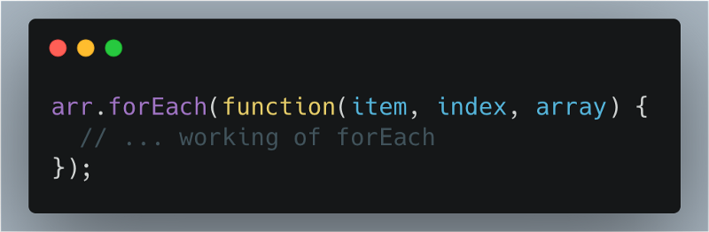
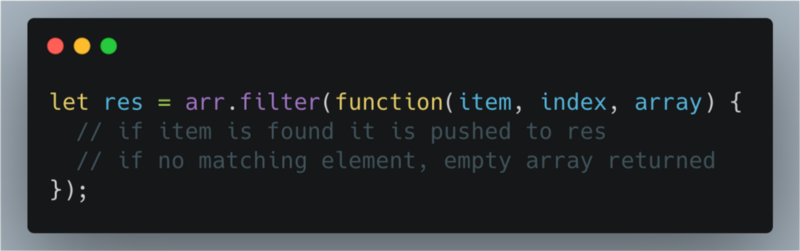
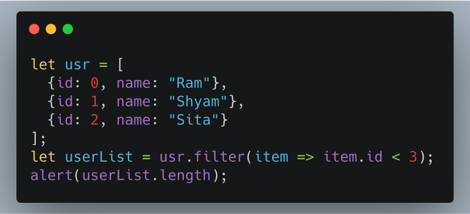
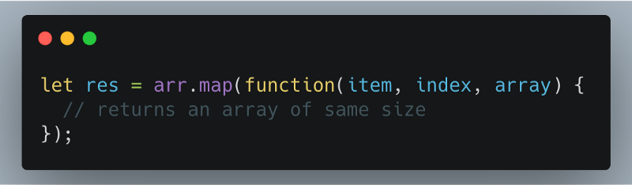

We are now going to have a look at a few Array methods which are commonly used.

### **forEach function**

This function iterates for every element of the array. It calls a **‘callback’** function in an ascending order.

The Figure 1, shows the syntax of forEach function. In this case ‘arr’ is the name of the array.

The `callback` function accepts between one and three arguments:

-   The current value of the element
-   The index of the element
-   The array for which the function was called upon

It returns ‘undefined’ because the result of the function is thrown away and ignored.

### filter function

For operations such as searching in an array **filter** function is most commonly used. It returns an array of same size or smaller than the original array it was called upon.

The filter method returns an array of all matching elements. The Figure 2, shows the syntax of the function.

For example:

### map function

When we need to transform an array we use functions like **map**. The map function returns an array of the same size.

### Thank You!
