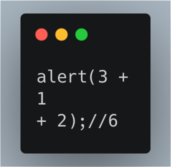
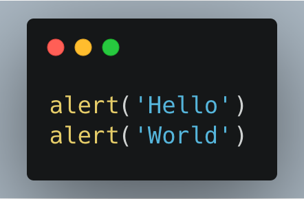
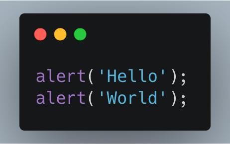

Before going into details of JavaScript let us first start with a very basic question — **“Why is it called JavaScript?”**

To answer the question in simple terms we need to delve into the minds of its creators. JavaScript was named in such a manner that it could be easily be marketed as a sibling of another popular language Java.

However, JavaScript is an independent language with its own specification called **ECMAScript**.

It is considered a safe language as it does not provide too much access to our systems.

Unique features:

-   Integration with HTML-CSS.
-   Supported by all major browsers.
-   General purpose language.

### **Getting started:**

Now let us begin our journey into the language. To start working with it; we can use our browser console as the working environment.

### **The “script” tag**

In an HTML document we can easily insert JavaScript programs with the help of the `****` tag.

In case of very long JavaScript codes it is better to keep it in a separate file and connect it to our HTML file. Apart from keeping the code simplified and organised, it has another advantage — the browser downloads it and stores it in cache. This makes the pages faster.

### **Code structure**

Before starting to write our own code we need to understand a few things about how to structure or code.

**Statements**

They are lines of commands or instructions to perform some action.

**Semicolons**

New line in JavaScript implicitly means a semicolon. However, this has exceptions too. Therefore, it is important to know when a line break implicitly means a semicolon and when it dose not.

For example:

The above code gives the output as 6. This happens because the line ends with `**“+”**`  making it an incomplete expression. Thus, a semicolon is not added implicitly.

However, both the codes in Figure 2 works fine with or without the semicolons.

**Comments**

It is a good practice to write comments. It makes the code more human readable. For a single line comment we can use `**//**`  and for multiple lines we can use `**/* … … …*/**`. An important thing to remember is that nested comments are not supported.

**Always “use strict”**

The `“use strict”` command enables the “modern” mode in the browser. It introduces some changes in the working of JavaScript and also fix some bugs in the system.

The strict mode is supported by all modern browsers.

**Thank You!**
