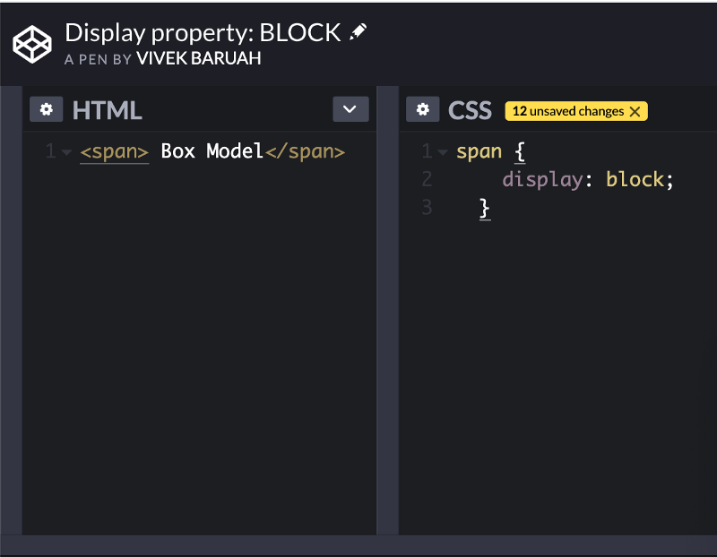
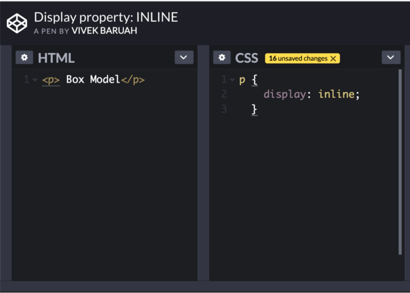
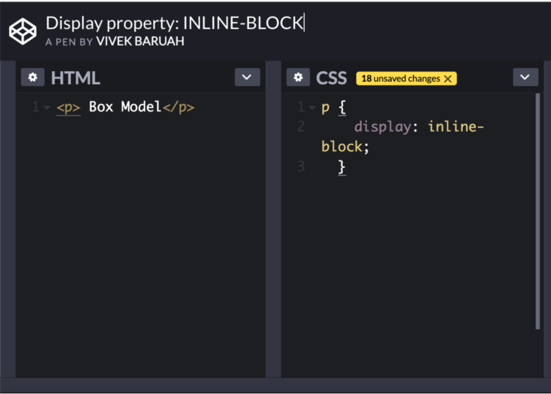
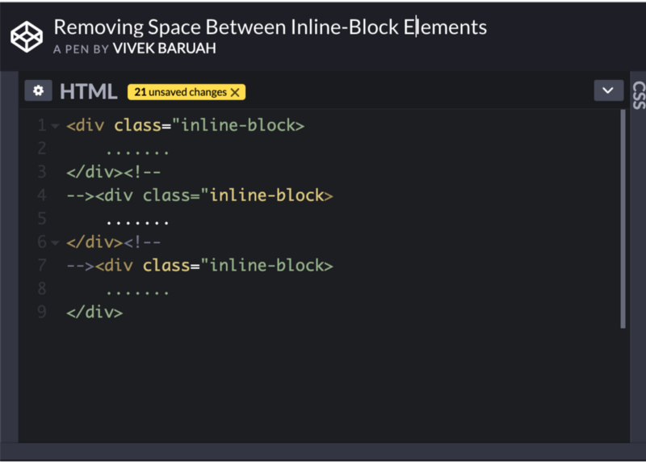
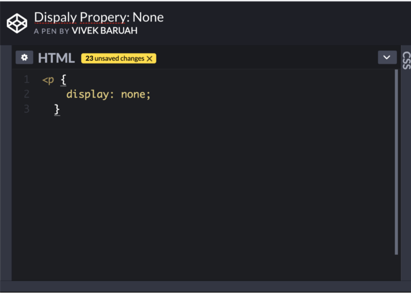
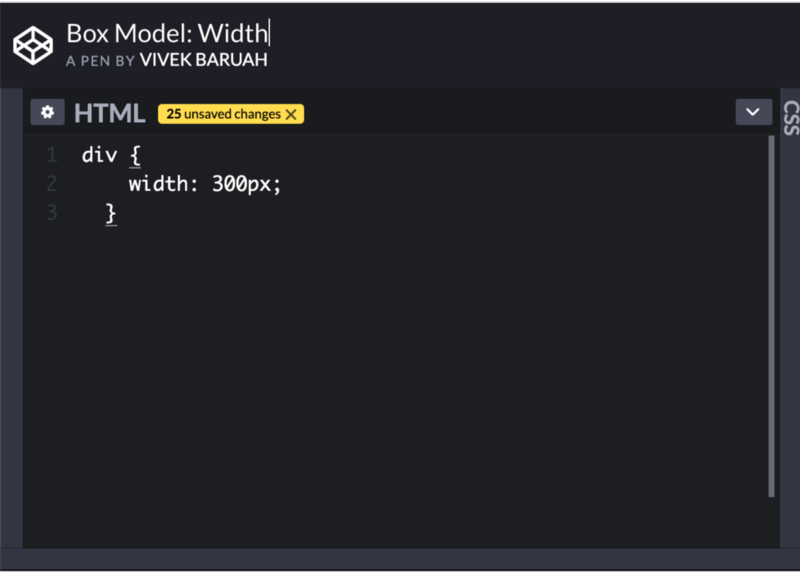
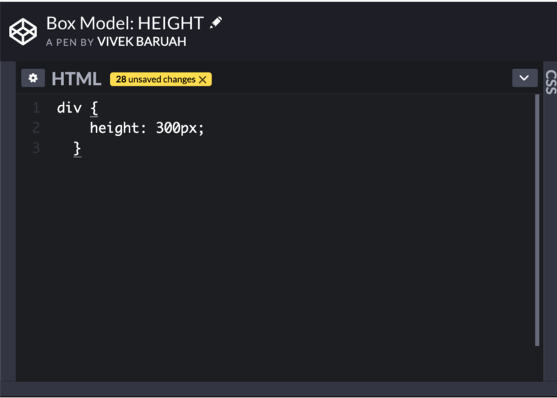
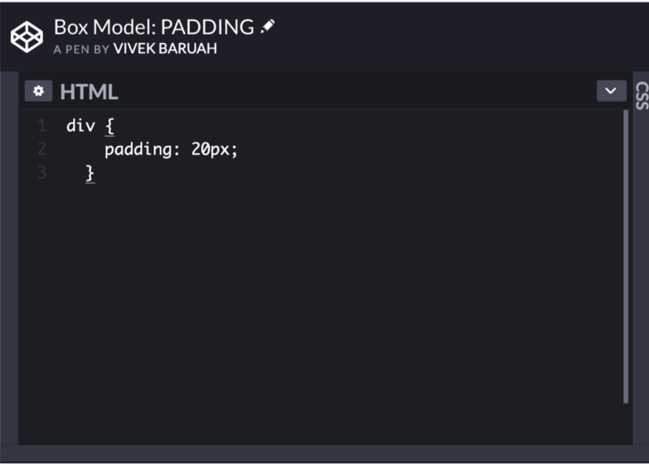
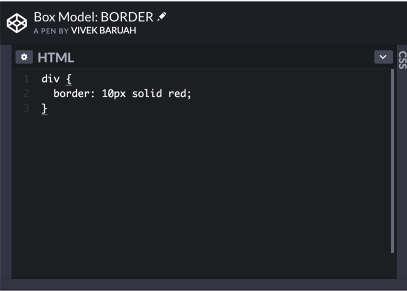

In Part I and II, we have learnt the working of HTML and CSS. So let us dig a little further and learn how elements are displayed by the browser.

**DISPLAY PROPERTIES:** Earlier we learnt that there are two types elements, block-level elements, and inline-level elements. The block-level elements always starts from a new line and takes the available width. While the inline-level elements take the space as much as it requires according to the content and lines up one after the other. Every element has a default display property value. It can be block, inline, inline-block, and none. However, we can over write these properties in CSS.

1.  Block: It converts any element into a block level element when we change its display properties.

Default property of **span** is **inline** but now it has been changed to **block**. Now it will behave like a block level elements and will accept all the box-model properties and values.

2\. **Inline:** In a similar manner we can change the display property of any element to make it behave like inline-level elements.

Here the default property of p is block-level element but now it will behave like an inline-level element because we have overwritten its display property.

3\. **Inline-block:** An inline-level element does not accept all the box-model properties and values. So we can use another display property value i.e. inline-block.

The element will take the space according to the content and will line up one after one instead of taking whole available width and starting from a new line. But at the same time, it will also accept all the box-model properties like block level elements.

**Removing Space between the inline-block elements:** Inline-block elements are not always touching whenever they come one after one. There is always a default small space which often disturbs the flow of content.

The easiest way is to open HTML comment just after the closing tag of an inline-block element and then close the HTML comment just before the opening tag of next inline-block element.

There are a few other ways to remove these spaces. We will discuss them later.

4\. **None:** This property is used to hide any element from the page.

The element behaves as if it dose not exist in the HTML page.

**Box Model**

As per the box model, every element is a rectangular box in a page. It may have some width, height, padding, borders, and margins.

1.  **Width:** Every element has some default width based on the display property. If it is a block-level element it will have 100% width covering whole horizontal space. If it is an inline or inline-block element it will have width according to the content it wraps. To set a specified width to an element we can use the width property:

One important thing we must note here that you cannot set a fixed width of an inline-level element. So if you try to specify a width to an inline element it won’t accept.

2\. **Height:** As every element has some default width in a similar way every element also has some default height and that is always determined by its content. Similarly width, height also cannot be fixed for the inline-level elements. So to specify the height of non-inline elements we can use the height property:

3\. **Padding:** It comes after width and height and falls inside the element’s border. Here is how the padding property is applied.

It is applied to provide space around the content, within an element .

4\. **Border:** The border is to provide some outline around an element. To apply border we have border property which requires three different values:border-width, border-style and border-color.

The above properties are applied in shorthand to define border-width, border-style and border-color in the same line of code.

There is another property for the border border-radius. With the help this property we can get a rounded or soft corner of the border. And the values can be in normal length units like pixels and percentage.

5\. **Margin:** The last property in the box model is the margin. The space instead of applying inside the element it is being applied outside the element. Margin property is applied to provide a gap between the elements in a page.

6\. **Outline:** The outline is similar to a border but stays outside the border. The way define border for an element in a similar way we can draw an outline. But the important point is that the outline is not considered as part of the box model.

7\. **Box Shadow:** It is used just to create a shadow effect around the element.

We will continue this series and study further about HTML-CSS.

**THANK YOU!**
