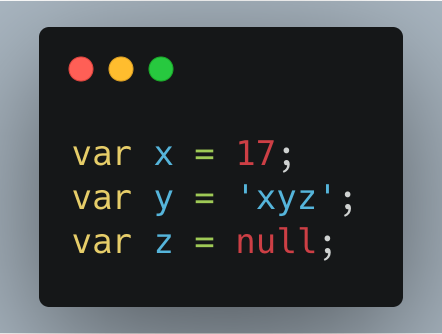
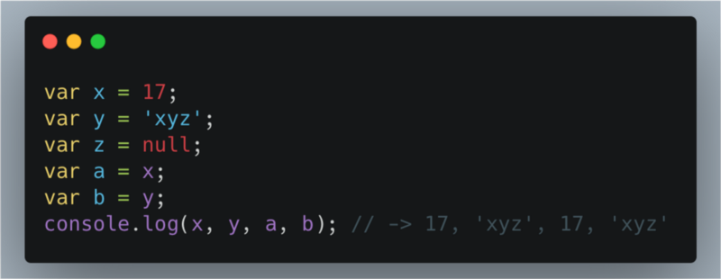
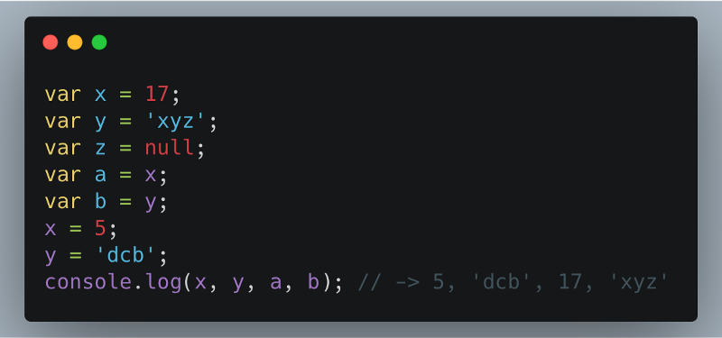
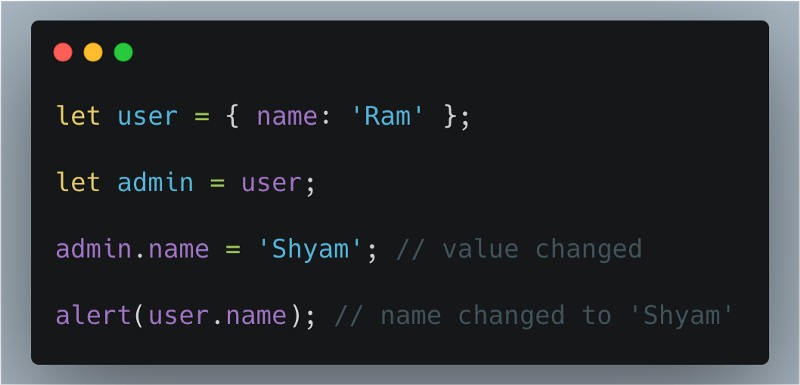

Copy-by-value and copy-by-reference methods have always confused budding programmers. To understand the nuanced difference between the two types of copy we need to understand what happens in the memory after we assign a value to it.

However, it should be kept in mind that we are going to study memory allocation only at a basic level for now.

### **Copy by value**

In a primitive data-type when a variable is assigned a value we can imagine that a box is created in the memory. This box has a sticker attached to it i.e. the variable name. Inside the box the value assigned to the variable is stored.

In Figure 1, `‘x’` contains value `17`, `‘y`’ contains `‘xyz’`.

In the Figure 2; the **values** in the boxes `‘x’` and `‘y’` are copied into the variables `‘a’` and `‘b’`.

At this point of time both `‘x’` and `‘a’` contains the value `17`. Both `‘y’` and `‘b’` contains the value `‘xyz’`. However, an important thing to understand here is that even though `‘x’` and `‘a’` as well as `‘y’` and `‘b’` contains the same value they are not connected to each other. It is so because the values are directly copied into the new variables.

Changes taking palace in one does not affect the other.

### **Copy by reference**

In case of a non-primitive data-type the values are not directly copied. When a non-primitive data-type is assigned a value a box is created with a sticker of the name of the data-type. However, the values it is assigned is not stored directly in the box. The language itself assigns a different memory location to store the data. The address of this memory location is stored in the box created.

In the Figure 3, when the value of admin is changed it automatically changes the value of user as well.

This happens because both `‘user’` and `‘admin’` are storing the address of the memory location. And when one changes the values in the allocated memory it is reflected in the other as well.

We can further elaborate it we can say that; copy by reference is like having two keys of the same room shared between `‘admin’` and `‘user’`. I one of them alters the arrangement of the room the other would experience it ads well.

**Thank You!**
