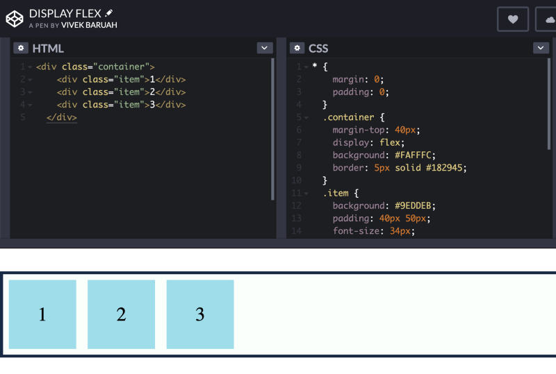

### Introduction

After going through the basics of HTML and CSS let us move on to the next topic. We have been through floats and inline-block elements. At the same time we did face some difficulties while using these properties. However, we have a much more simpler and easier way to position our content using flexbox.

Let us start with the very basic question : **What is flexbox?**

Flexbox is a new layout mode in CSS3. The **Mozilla Developer Network** defines flexbox as a one-dimensional layout method, for laying out items in rows or columns. Items flex to fill additional space and shrink to fit into smaller spaces.

It gives us the ability to align the items and distribute space among them. Flexbox gives us flexibility to place our content in a page.

We give _display : flex_ property to the parent this places us in the zone of the flexbox model.

**Flex container** is the **Parent** element where _display : flex_ property is applied.

**Flex items** are the children elements inside the flex container.

In the flexbox model some sets of properties and values belongs to parent container and few to the children items.

Flex Container properties: Some of the properties that can be applied to flex containers are: display, flex-direction, flex-wrap, flex-flow, justify-content, align-items, align-content etc.

A. **Display:** It activates the flexbox model zone. It takes two values: _display:flex_ and _display: inline-flex_.

B. **Flex Direction:** It determines the direction of the items. By default all the items lay down on the main-axis.

C. **Flex Wrap:** Flex wrap accommodates extra items.

D. **Justify Content:** It makes the method more flexible. It takes six different values.

**Flex Start:** It is the default value. All the items starts from the starting point on the “main-axis”.

**Flex End:** It lays the items towards the endpoint of the “main-axis”.

**Center:** This value places the items along the “main-axis” line.

**Space Between:** The extra space in the container is distributed evenly.

**Space Around:** The extra space in the container is distributed around the items.

**Space Evenly:** It distributes the extra space in such a way that the space between the items and the items and the edges remains equal.

E. **Align Items:** This property determines the layout of the items on the “cross-axis”. We can apply the following values to this property.

**Stretch:** It is the default value. The items are stretched on the “cross-axis” to fill the extra space inside a container.

**Flex start:** The items will be laid out from the starting point on the “cross-axis”.

**Flex End:** The items are laid out towards the endpoint on the “cross-axis”.

**Center:** This property places the items the "cross-axis" line.

**Baseline:** The items are aligned based on the baseline of text inside the items.

D. **Align Content:** This property also works on the “cross-axis”. It accepts the following properties.

**Stretch:** It is the default value.

**Flex Start:** The multi-line items will be aligned from the starting point on the “cross-axis”.

**Flex End:** The items are aligned towards the endpoint on the “cross-axis”.

**Center:** The items are placed at the center of the "cross-axis".

**Space Between:** It distributes the space between the items on the “cross-axis”.

**Space Around:** It distributes the spaces around the items on the “cross-axis”.

So far we have learnt about various properties which can be applied to the flex-box and the items inside it. We will delve further into the properties of the flexbox in the upcoming parts.

### THANK YOU!
