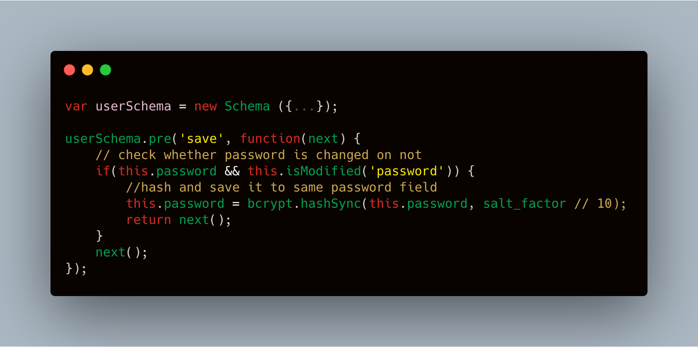
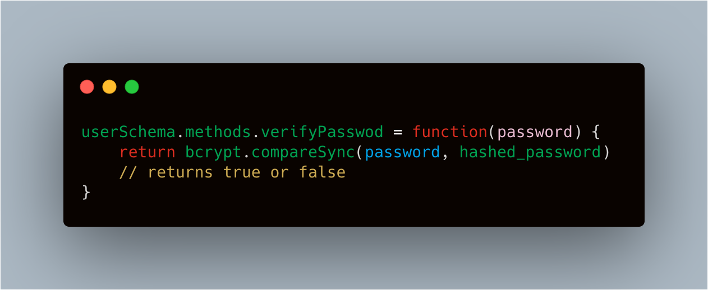
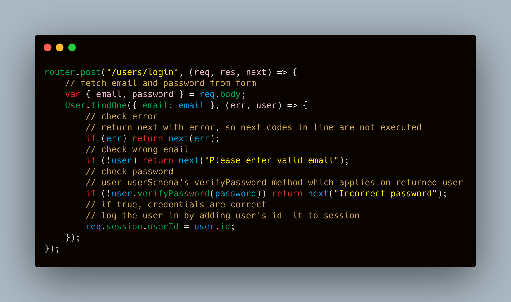

---

title: 'Hashing Passwords In NodeJS' description: 'Hashes and salts mostly used before saving passwords in the database. This converts the plain text password into…' date: '2020-05-11T12:52:39.588Z' categories: [NodeJS, JavaScript, BackEnd] published: false

--- Hashes and salts mostly used before saving passwords in the database. This converts the plain text password into a random string. It is an irreversible conversion of strings of arbitrary length to hashed strings of fixed length.

Another important thing in this process is Salt which are added to strings before hashing. It makes the hashed strings more secure by adding to the complexities.

**Using Bcrypt In NodeJS**

In this article we are going to discuss about Bcrypt which is available as an NPM Package. It can be installed locally by running the following command in the terminal.

`**npm install bcrypt**`

This will automatically add `**bcrypt**` to `**package.json**` file. The next step is to include it in the project.

```js
const bcrypt = require('bcrypt')
const saltRounds = 10
```

Bcrypt has both synchronous and asynchronous modes of operation. However the recommended approach is asynchronous. It is because hashing is a memory intensive process and the synchronous version blocks the event loop until the process is completed.

We are going to use pre-save hooks for hashing the password in the userSchema. The following code is valid if we are registering for the first time or modifying a password. In both the cases the password will be hashed before being stored in the database.



To validate the password we can define methods on the Schema and use the following code.



In the login routes, now we can verify a user credentials (email and password) to log a user in, if credentials match the one saved with database.



Thus we can safely store the passwords in our database. Here the database admin also has no access to the passwords of the users as it is stored in hashed format instead of plain-text.

**Thank You!**
