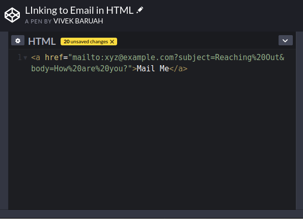

One of the most commonly used terms in today’s world is Web. So let us start with the question “What is Web?”

The **Web** or the **World Wide Web** is a collection of documents which can be accessed over the [Internet](https://en.wikipedia.org/wiki/Internet). These documents are published by using a _web server_ and accessed using a _web browser_.

The Web was invented by Tim Berners-Lee in 1989. However, it only after 1991 the Web was released to the general.

The documents published by a web server are known as a **website**. A website contains a number of resources including web pages and images. The different pages of a website are generally addressing a common theme or topic. Probably one of the most widely known example is: [www.google.com](https://www.google.com/).

Now let us address another common question “What is web development?”

Simply put we can say that web development is the process of building a website for the internet. However, in more precisely we say that web development is the interaction between the _client_ and the _server._

The client can be your laptop, desktop, mobile phone, tablet or any other similar device. The server is a specialised computer entrusted with the responsibility of hosting various websites.

The people who work in the processes visible to the client are known as **Front end developers** and those who work with the processes running in the server are known as **Back end developers**.

Front end developers mainly work in HTML, CSS and Java Script.

So let us begin with: “What is HTML-CSS?”

HTML or Hyper Text Markup Language is used to give a simple structure to the website and marks up the raw content. Therefore, it is considered as a markup language and not as a programming language. All the content visible to the client (in the website) is controlled by HTML.

Some common terms in HTML are Elements, Tags and Attributes

**Elements:** The basic building blocks of HTML is the Element. They define the structure and content in a webpage. Some frequently used elements are: heading (designated as “h1”, “h2”, ….“h6”), paragraphs (designated as “p”) and many more.

**Tags:** When the element is wrapped in the less than and greater than symbols it is known as a Tag. They mostly occur in pairs, however, there are a few exceptions too. We will discuss the exceptions later.

The opening tag designates from where the element begins and the closing tag i.e. the name of the opening tag in between greater-than and less-than symbols with a forward slash. For example: `<h1>` is an opening tag and `</h1>` is its closing tag.

**Attributes:** Attributes are used to provide some extra information about the element. The information contained in them is not displayed in the webpage.

In figure 1: `<a>`is the name of the element. When the element is wrapped in angle brackets or `<>` it becomes a tag.

Attribute always written within the opening tag after the elements name. The `<href>` is its name and “[https://www.google.com/](https://www.google.com/)” is the value.

**Setting up a HTML Document Structure:**

HTML documents are simply a plain text editor saved with a .html file extension. The above line of codes is the standard HTML document structure, which you’ll require every time.

`**<!DOCTYPE html>**`**:** This declaration informs the browser which version of HTML being used.

`**<html>**`**:** It signifies the starting and ending the document.

`**<head>**`**:** The instructions which comes inside `<head>` element are not visible in the page.

`**<body>**`**:** The visible content is written inside body tags.

**Self Closing Elements:** The ‘meta’ tag used in the above code snippet is an example of self-closing tag. These elements don’t require a closing tag. They get their content from the attribute of a single tag.

**Nesting and Indentation:** Nesting is the process of placing an element inside another. When some spacing is provided to make the code more legible it is known as Indentation.

**Semantic tag:** Semantic is the optimum use of element for appropriate content. One of the uses of semantic elements is search engine optimisation (SEO).

**Block vs Inline:** Elements are broadly classified into Block and Inline. Block-Level elements always begins in a new line.

**Hyperlinks:** Links are created using an anchor tag i.e. `<a>` with an `<href>` attribute. Depending on the link provided inside the href attribute of an anchor link, a link can have two types of path **Relative path** and **Absolute path**.

**Relative path:** In the above figure the link connects to the other page (About page) of the same website therefore it is considered as a relative path.

**Absolute path:** The link in figure 4 connects to another website (google.com) therefore it is known to have an absolute path.

However, figure 4, has `**target=“_blank”**`  as an extra attribute. It opens the link in a new tab.

**Linking to email:** The example provided in figure 5 will enable an email link along with subject and body text.

So far we have covered the basics of HTML.

We will discuss CSS and Java Script in the upcoming parts.

**Thank You!**
