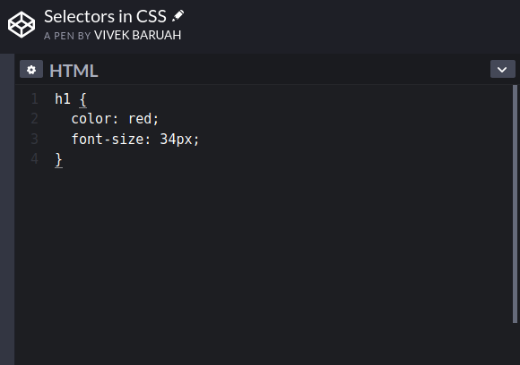
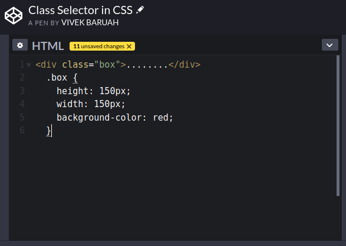
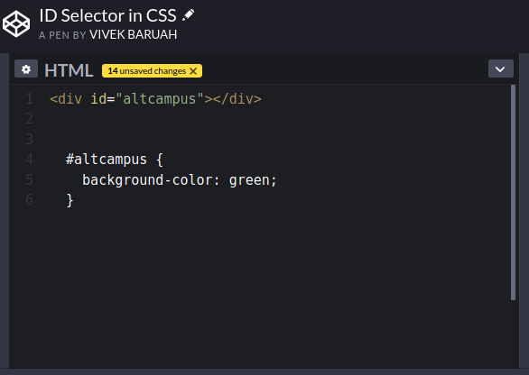

**Intro to CSS**

In this part we are going to discuss how to style a page with different background colors, font-sizes, etc. In CSS the styles fall from top to bottom in a stylesheet. This is known as cascading.

Let us begin with some common terms of CSS.

**Selectors, Properties and Values:** In the above figure 1, `h1` is the selector, `color` & `font-size` are the properties and `red` & `34px` are the values.

**Type Selectors:** The above example the manner in which the element is targeted is known as type selector.

**Class Selectors:** Class selector in CSS is denote it with **.** followed by the value of class attribute.

ID Selectors: ID selector is more specific than class and type selector. To target an element using an ID selector in CSS we use `**#**` followed by the value defined inside the ID attribute.

**Referencing CSS:** To connect a CSS file we create an external stylesheet file and connect it to HTML . In internal styling, we define a style tag inside the head element and then we write our CSS.

However, the best practice is to have one separate stylesheet to write our CSS and then connect it with `**<link>**`  tag inside the head element. This keeps the both HTML & CSS code separately in a more organised manner.

**CSS Resets:** CSS resets are used to show similar styles in different browsers. It removes all the default sizing, margin, padding and all the additional styles from the element.

One of the most popular is [**Eric Meyer’s reset**](https://meyerweb.com/eric/tools/css/reset/).

**Specificity weight of selectors:** We have studied three types of selectors i.e. type, class, and ID. Each selector has a specific weight in CSS. In the specificity table, type selector has the lowest weight, class selectors has medium weight and ID selector has the highest weight.

**Common CSS Property & Values:**

A. **Colors:** There are four most common ways to apply color in CSS.

1.  **Keyword Values:** In this approach we just write the name of the required color.
2.  **Hexadecimal Values:** The hexadecimal values are represented in three or six characters and the value always consist pound or hash `#`at the beginning.
3.  **RGB Values:** The RGB colors and are represented with function `**rgb()**` which stands for red, green and blue colors. The values are in integer with comma separated. The first value represents the red, second green and last value represents blue color. And value can be anything from 0 to 255.
4.  RGBa Values: It is represented with function `**rgba()**`. Here `a` stands for alpha values to RGB colors. It must be a number between 0 to 1. They are mostly used to provide some transparency to the colors.

There are several other ways of defining color, however, they are not widely used and accepted by every browser.

B. **Lengths:** One of the easiest ways to define length is by using pixel(px). But there are other ways as well. They are categorised into two categories.

1.  **Absolute Lengths:** Examples of absolute lengths are pixel, centimetres, inches, etc. The absolute lengths are always fixed. It won’t respond as the size of the screen increases or decreases.
2.  **Relative Lengths:** The relative lengths are different from the absolute lengths as they are not the fixed unit. It relies on other units of measurement. The most common relative units are percentage, em, vm, rem, etc.

Relative units will be discussed in detail when we reach the responsive web design part in HTML & CSS.

Thus we have covered some of the basic concepts of HTML-CSS in the first two parts. We will be discussing other important topics in the next part.

**Thank You!**
