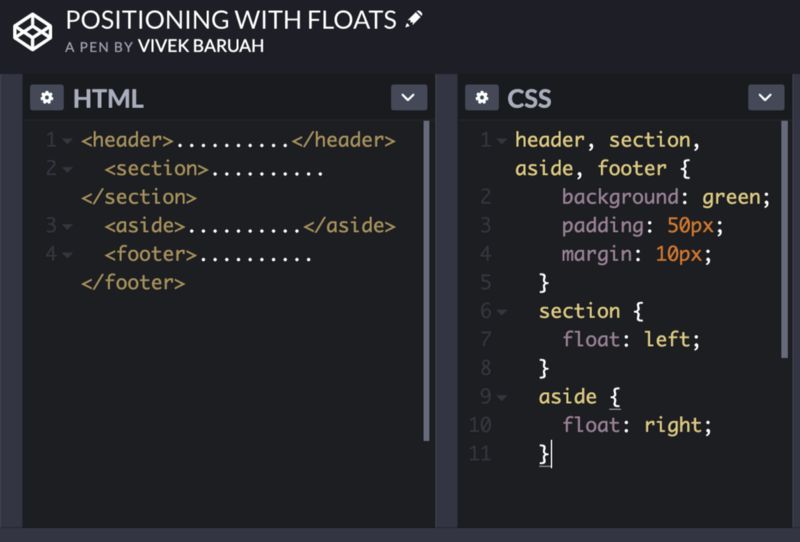
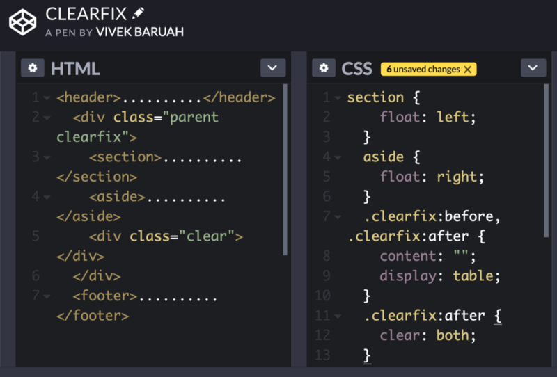
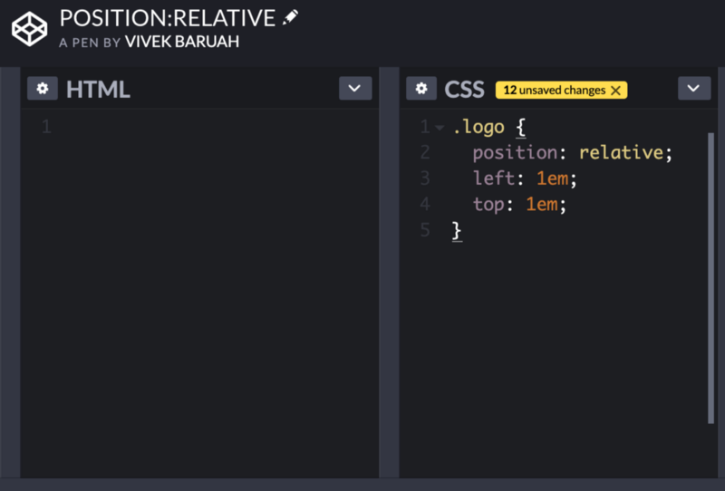
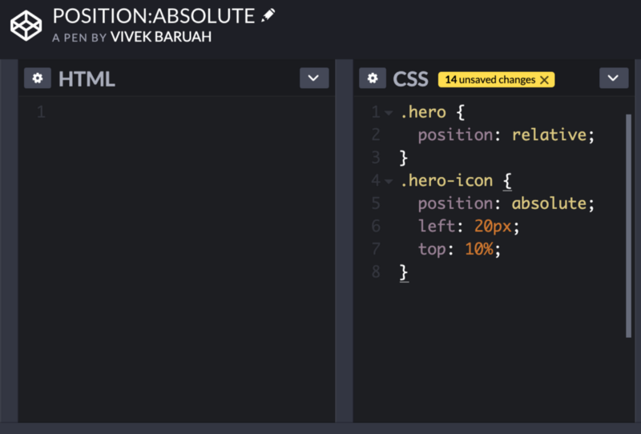
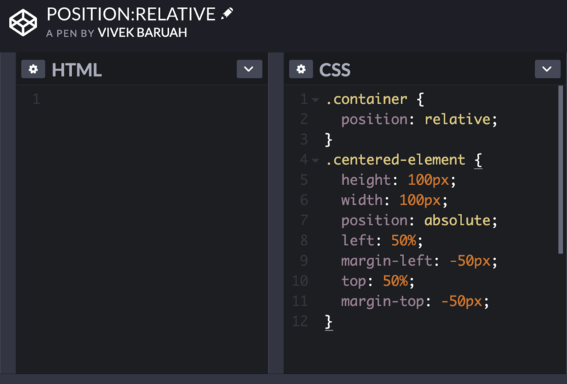

Moving on we are now going to learn how to manipulate the positions of content in a page. We can achieve this using different methods.

1.  Positioning with floats

Floats let the element to position side by side. It can make the even block level element to come in one line instead of on top of each other. The float comes with three different values: left, right and none. Left and right value send the element to the left and right of the parent element respectively.

And the last value none has no effect on the element. This is the default value, if the element has no float property then it will be considered as floated none.

An important thing to remember is that when we float any element then it is removed from the normal flow of the page which also alters the default display property of the element.

It means a block level will start taking the space according to the content it wraps despite their default display property of taking available width.

Clearfix Technique is one of the most effective ways to contain floats.

We apply a class to parent element containing floated elements and then we define some sort rules to that class in CSS.

We will read further about other more suitable techniques for positioning our content in the upcoming chapters.

Position: Relative

Using this lets you specify an offset with top, bottom, left and right.

This can be useful to do a simple offset without using something like margin, but it becomes really powerful when containing a child with position: absolute. Absolute positioning bases the elements position relative to the nearest parent element that has position: relative set. If it can’t find one, it will be relative to the document.

Absolute positioning should not be used to layout columns of content. Because the elements are removed form the document flow, that means every time you add content to one section, you may have to adjust the sizes of other sections by hand, and it makes responsive design much more of a hassle than it needs to be. Reserve absolute positioning for getting those small design elements exactly where you want them to be. As a general rule, if an element can be simply positioned using floats or a change to the display styles, it is probably best to avoid absolute positioning.

Something that can be very useful but stumps a lot of beginners is centering elements with absolute positioning. If your element has a set size, it’s just a matter of offsetting using margins. Let’s take the last example but center the icon both horizontally and vertically. To center an element using absolute positioning, just follow these steps:

1.  Add left: 50% to the element that you want to center. You will notice that this aligns the left edge of the child element with the 50% line of the parent.
2.  Add a negative left margin that is equal to half the width of the element. This moves us back onto the halfway mark.
3.  Next, we’ll do a similar process for the vertical axis. Add top: 50% to the child.
4.  And then add a negative top margin equal to half its height.

This means that even though the container may change sizes, the centered element will stay right where we want it. The resulting CSS should look something like this:

Fixed  positioning works like absolute, but is always relative to the viewport rather than the document and will remain in place when the user scrolls. This can make your app feel more like a native application, with a fixed header or side navigation, or for any element you want to keep in easy reach. Like absolute positioning, fixed elements will be removed from the document flow, so you may need to add padding on an element beneath them to make sure your other content will still be visible.

The position property gives us the advantage of being able to specify the z-index of our elements. If we go back to our metaphor of seeing elements as pieces of paper, setting the z-index property allows us to specify whether our paper is above or below the other pieces. A higher number will appear above, and a higher number will appear below. You can also use a negative number, which may make the element appear behind the parent (or even behind the document entirely!). This can lead to a sort of arms race with higher and higher numbers to ensure an element always sits on top. This can get pretty unmanageable and it is better to use positioning and z-indexes conservatively.

We will learn about Flexbox in the upcoming chapters.

**THANK YOU!**
