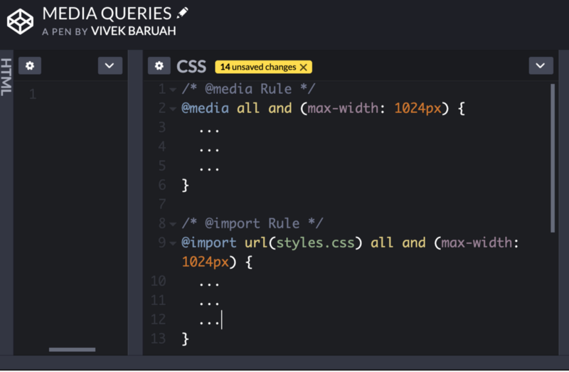
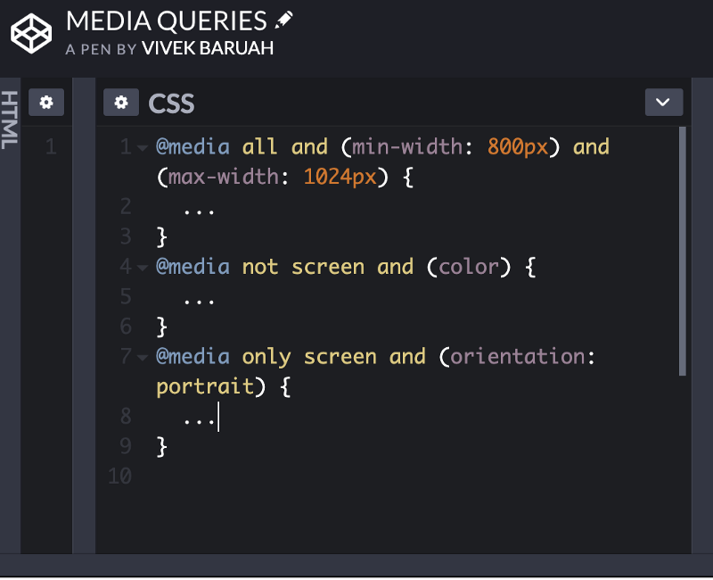
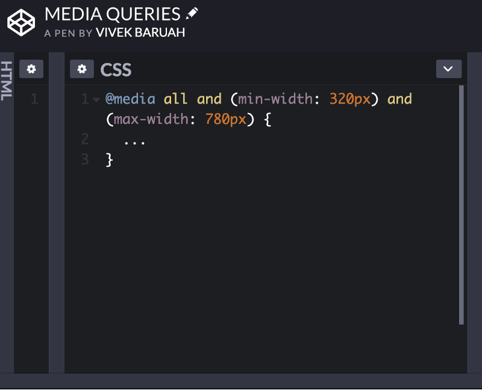

Today we are going to learn about responsive web design. Internet usage through mobiles is increasing at a tremendous pace and it is expected to grow in times to come.

This posed a new challenge for the web developers. How to build websites for all kinds of devices. Some very smart people came up with responsive web design as the response.

It makes the website work on all devices irrespective of the screen size.

Broadly classified responsive web design have three main components:

1.  **Flexible Layouts:** One of the methods to create a flexible layouts is by building flexible containers. We can do this by simply changing, the _‘width’_ property of the container, to max-width.
2.  **Media Queries:** They enables us to specify different styles different devices.

Media query includes one following media types: all, screen, print, tv and braille. In HTML5 introduced new media types including 3D glasses. Screen is the default the media type.

**Logical Operators in Media Queries:** Logical operators in media queries are _‘and’_, _‘not’_ and _'only’_.

The _‘and’_ operator allows extra conditions to be added.

The _‘not’_ operator negates the query.

The ‘only’ operator selects one type of queries and operates on them only.

**Height & Width Media Features:**

One of the most commonly used features are max-width and min-width. It reduces confusion with device screen sizes.

The third and the last component of responsive web design is **Responsive media** which is to be discussed in the next chapter.

**THANK YOU!**
