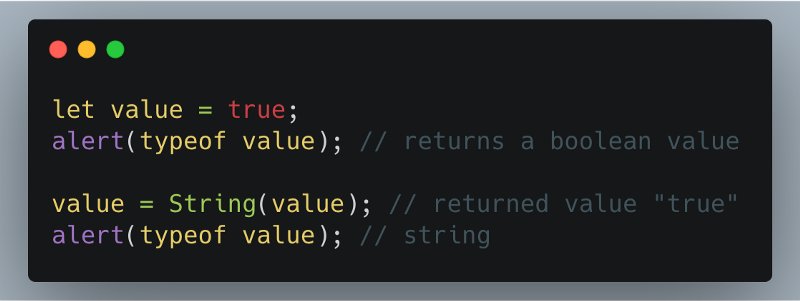
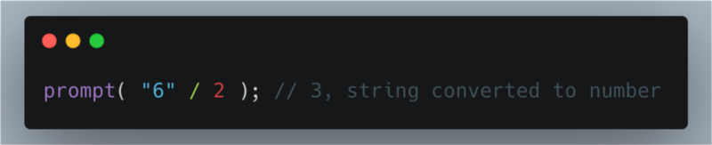

In JavaScript values are converted from one type to another. Many a times it is done by the language itself and is called implicit type conversion. However, sometimes we need to specifically tell the language to do it; it is known as explicit type conversion.

**String conversion**

In the Figure 1 shows conversion of boolean type data to a string.

**Numeric conversion**

In mathematical expressions numeric conversion is done by the language itself. For example:

Sometimes when we need to explicitly convert a value to a number we use `**Number(value)**` or `**+(value)**`**.** It is needed when we are reading from a string but the expected output is a number. However, when the string is not a valid number the result of conversion is `**NaN**`.

**Boolean conversion**

The simplest of the conversions is Boolean conversion. It returns only two values either `“**true**”` or `“**false**”`.

Rules:

-   Values like 0, empty string, null, undefined and NaN become “false”.
-   Other values become “true”.

**Thank You!**
